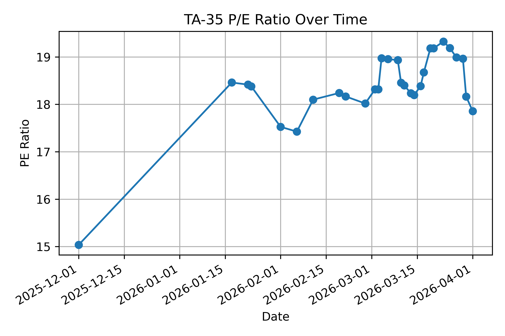

# Tel Aviv Stock Exchange (TASE) TA-35 P/E Ratio Scraper
Data scraping to calculate the PE ratio of the TA-35 index.

## Prerequisites

``` pip install -r requirements.txt ```

[ChromeDriver](https://chromedriver.chromium.org/)

## TA-35 P/E Ratio calculation
Use the following script to scrape the financial data of the TA-35 companies.
```
python scrapeData.py
```
You need a TASE account to download the data; the script will prompt you to log in via the browser.
After scraping the data, you can calculate the PE ratio of the TA-35 index by running the `dataAnalysis.ipynb` notebook.


